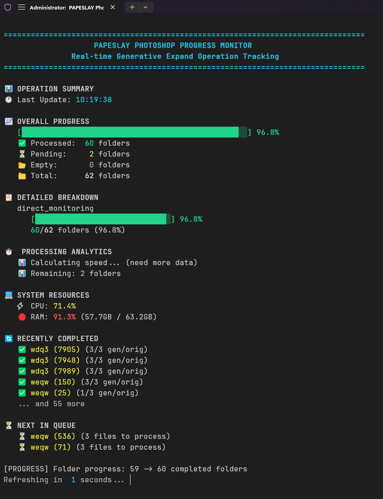

# Photochop Progress Analyzer

Real-time monitoring system for Photoshop generative expand operations with colorized output, progress bars, and detailed folder-by-folder analysis.

## 🚀 Features

- **Real-time Progress Tracking**: Monitor Photoshop generative expand operations in real-time
- **Colorized CLI Output**: Beautiful, easy-to-read console interface with progress bars
- **Flexible Path Support**: Auto-detect project structures or monitor custom folders  
- **Performance Analytics**: Track processing speed, completion estimates, and trends
- **System Resource Monitoring**: CPU and RAM usage tracking
- **Stagnation Detection**: Alerts when progress stalls for extended periods
- **Interactive Menu System**: Easy-to-use batch file interface
- **Cross-Platform Support**: Works on Windows, macOS, and Linux

## 📸 Live Example



*Real-time monitoring showing 96.8% completion (60/62 folders processed) with performance analytics, system resource monitoring, and detailed progress breakdown.*

## 📋 Requirements

- **Python 3.7+** with the following packages:
  - `psutil` (for system resource monitoring)
  - `tkinter` (usually included with Python)
- **Windows**: Administrator privileges required for the batch file launcher
- **Photoshop**: Any version that creates files with `gen-` prefix for generative expand

## 🛠️ Installation

### Option 1: Download Release (Recommended)
1. Download the latest release from [GitHub Releases](https://github.com/aaronvstory/photochop-progress-analyzer/releases)
2. Extract to your desired location (e.g., `C:\Tools\photochop-analyzer\`)
3. Install Python dependencies:
   ```bash
   pip install -r requirements.txt
   ```
4. Run the application

### Option 2: Clone from Source
```bash
git clone https://github.com/aaronvstory/photochop-progress-analyzer.git
cd photochop-progress-analyzer
pip install -r requirements.txt
```

## 🚀 Quick Start

### Windows (Recommended)
1. **Right-click** `src/run_photoshop_monitor.bat` and select **"Run as Administrator"**
2. Choose option **4** to select your folder containing Photoshop projects
3. Choose option **2** for continuous monitoring or **1** for single checks

### Command Line (All Platforms)
```bash
cd src/
python photoshop_monitor.py --select-folder    # Select monitoring folder
python photoshop_monitor.py                    # Single progress check
python photoshop_monitor.py --monitor          # Continuous monitoring
python photoshop_monitor.py --path "C:\Your\Custom\Path"  # Custom path
```

## 📁 How It Works

The analyzer monitors folders containing image files and tracks the presence of `gen-` prefixed files created by Photoshop's generative expand feature.

### Folder Structure Example
```
Your Project Folder/
├── user_001/
│   ├── original1.jpg
│   └── gen-original1_expanded.jpg  ✅ PROCESSED
├── user_002/
│   ├── original2.jpg
│   └── original3.jpg               ⏳ PENDING
└── user_003/
    └── gen-photo1_expanded.jpg     ✅ PROCESSED
```

### Detection Logic
- **Processed Folder**: Contains ANY files starting with `gen-`
- **Pending Folder**: Contains image files but NO `gen-` files
- **Empty Folder**: No image files found

## 🎯 Menu Options

When using the batch file launcher:

1. **Single Check** - Quick one-time progress analysis
2. **Continuous Monitor** - Real-time monitoring with 30-second updates
3. **Exit** - Close the application
4. **Change Folder** - Select a new folder to monitor

## 📊 Output Features

### Progress Overview
- **Overall Progress Bar**: Visual representation of completion status
- **Folder Counts**: Processed, pending, and empty folder statistics
- **Category Breakdown**: Progress by project subdirectories

### Performance Analytics
- **Processing Speed**: Folders processed per minute
- **ETA Calculation**: Estimated time to completion
- **Speed Trends**: Performance increase/decrease detection
- **System Resources**: CPU and RAM usage monitoring

### Real-time Updates
- **Recently Completed**: Last processed folders
- **Next in Queue**: Upcoming folders to process
- **Stagnation Alerts**: Warnings when progress stops

## 🔧 Configuration

The analyzer creates a `monitor_config.json` file to store settings:

```json
{
  "base_path": "C:\\Your\\Monitoring\\Path",
  "last_update": "2025-07-01T10:30:00.123456"
}
```

### Customizing Default Path
Edit `src/monitor_config.json` before first run:
```json
{
  "base_path": "C:\\Your\\Default\\Path",
  "last_update": null
}
```

## 📈 Performance Tracking

Progress data is logged to `photoshop_progress_log.json` including:
- Session timestamps and progress snapshots
- Individual folder completion tracking
- Processing speed history
- System resource usage over time

## 🐛 Troubleshooting

### Common Issues

**"Python not found in PATH"**
- Install Python from [python.org](https://python.org/downloads)
- Ensure "Add Python to PATH" is checked during installation

**"Administrator privileges required"**
- Right-click the batch file and select "Run as Administrator"
- Or run Command Prompt as Administrator

**"No data found for path"**
- Verify the selected folder contains subfolders with image files
- Use option 4 to select a different folder
- Check folder permissions

**Performance Issues**
- Close unnecessary applications to free up system resources
- Ensure Photoshop has sufficient RAM and isn't waiting for user input
- Check for system resource alerts in the monitoring output

### Debug Information
The analyzer automatically creates debug files when issues occur:
- Check console output for error messages
- Review `photoshop_progress_log.json` for historical data
- Verify folder structure matches expected format

## 🔒 Security & Privacy

- **No Data Collection**: All monitoring happens locally
- **No Network Access**: No data sent to external servers
- **File Read-Only**: Only reads file listings, never modifies content
- **Local Logs**: All progress data stored locally in JSON format

## 🤝 Contributing

1. Fork the repository
2. Create a feature branch (`git checkout -b feature/amazing-feature`)
3. Commit your changes (`git commit -m 'Add amazing feature'`)
4. Push to the branch (`git push origin feature/amazing-feature`)
5. Open a Pull Request

## 📝 License

This project is licensed under the MIT License - see the [LICENSE](LICENSE) file for details.

## 🎯 Use Cases

### Professional Workflows
- **Batch Processing**: Monitor large batches of generative expand operations
- **Quality Control**: Track completion rates across different projects
- **Resource Planning**: Understand processing times for future projects

### Personal Projects
- **Photo Enhancement**: Track progress on personal photo collections
- **Art Projects**: Monitor generative expand operations on artwork
- **Archive Processing**: Process large image archives efficiently

## 🔮 Roadmap

- [ ] Web-based dashboard interface
- [ ] Email/SMS notifications for completion
- [ ] Integration with other Adobe Creative Suite applications
- [ ] Batch operation queue management
- [ ] Advanced filtering and search capabilities
- [ ] Export progress reports to PDF/Excel

## 📞 Support

- **Issues**: Report bugs via [GitHub Issues](https://github.com/aaronvstory/photochop-progress-analyzer/issues)
- **Discussions**: Ask questions in [GitHub Discussions](https://github.com/aaronvstory/photochop-progress-analyzer/discussions)
- **Documentation**: Check the [Wiki](https://github.com/aaronvstory/photochop-progress-analyzer/wiki) for detailed guides

## 🏆 Acknowledgments

- Built with Python and love for efficient workflows
- Inspired by the need for better Photoshop batch operation monitoring
- Thanks to the open-source community for excellent libraries like `psutil`

---

**Made with ❤️ for Photoshop power users**
